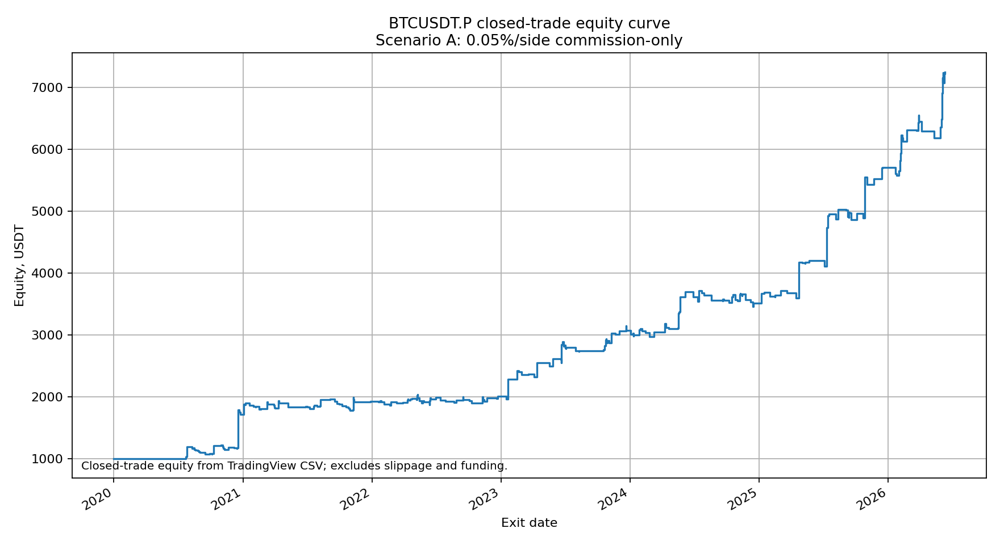

```
                                             __               
                                 _________ _/ /___ _____      
                                / ___/ __ `/ / __ `/ __ \     
                               / /  / /_/ / / /_/ / /_/ /     
                              /_/   \__,_/_/\__, /\____/      
                                           /____/             
```
Public evidence repository for **ralgo**, a BTC futures algorithmic trading system. This repo is the auditable public record behind future SaaS access; it does not sell or publish the strategy source code.

## Verified Headline

Current recommended public headline: **+623.91% net return**, **10.86% max drawdown**, **PF 2.265**, **510 trades** on `BINANCE:BTCUSDT.P` 15m, measured in TradingView Deep Backtesting with 0.05% taker fee.

Funding is not measured by TradingView. The analytical funding layer moves the realistic all-in estimate to roughly **+375% to +450%** net return, with a central anchor near **+374.4%**. Treat every number here as backtest evidence, not a live-return expectation.

## Equity Curve



| Regime | Start equity (USDT) | End equity (USDT) | Net PnL (USDT) | Return % | Closed trades | 
|---|---:|---:|---:|---:|---|
| 2020-01-01 -> 2022-01-01 | 1,000.00 | 1,925.98 | 925.98 | 92.60% | 142 |
| 2022-01-01 -> 2024-01-01 | 1,925.98 | 3,071.70 | 1,145.72 | 59.49% | 168 | 
| 2024-01-01 -> latest* | 3,071.70 | 7,239.07 | 4,167.37 | 135.67% | 200 |

## Evidence Pack

- [`performance/`](performance/) - canonical methodology, limitations, metrics, tables, charts, raw runs, and audit logs.
- [`performance/public_metrics.json`](performance/public_metrics.json) - single machine-readable public metrics contract.
- [`performance/charts/`](performance/charts/) - public charts with no private source visible.
- [`reports/monthly/`](reports/monthly/) - monthly public summaries.

## Public Safety Boundary

This repository may contain aggregate metrics, charts, CSV tables, audit logs, methodology notes, and monthly reports. It must not contain private Pine Script source, exact signal thresholds, webhook URLs, account IDs, API keys, or automation infrastructure.

## Risk Notice

Trading leveraged crypto futures is high risk. Backtests can fail in live execution because of funding, slippage, missed fills, exchange outages, liquidity, regime changes, and overfitting. Nothing in this repository is financial advice, investment advice, a recommendation, or a guarantee of profit.

## License

All rights reserved. Public materials are published for research visibility only; the underlying strategy and automation remain proprietary.
